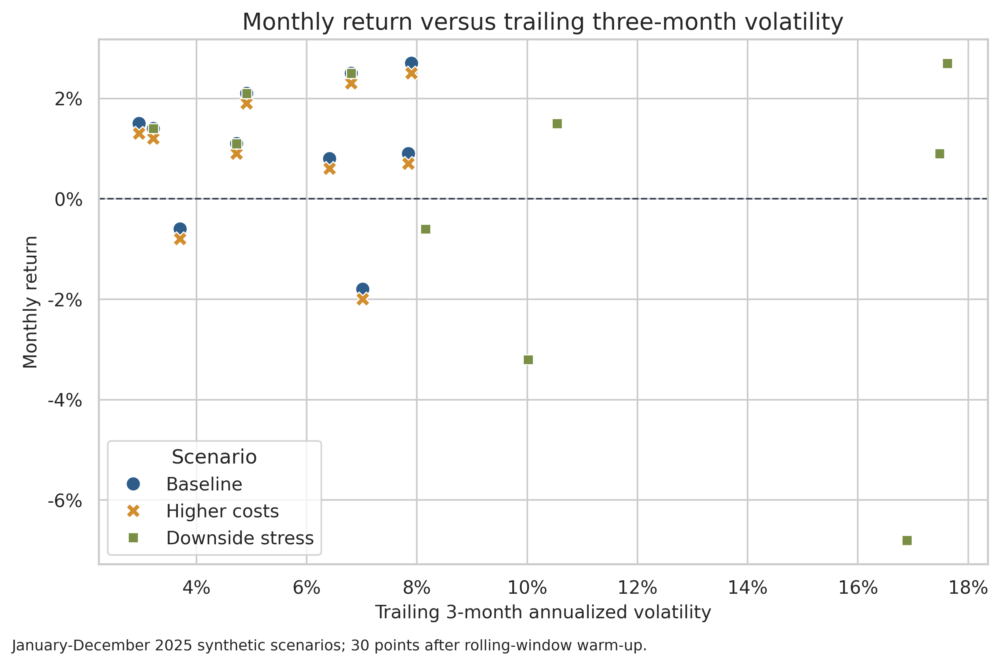
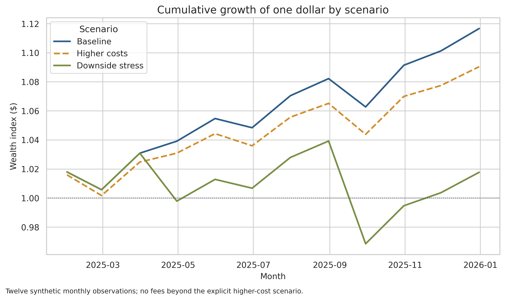
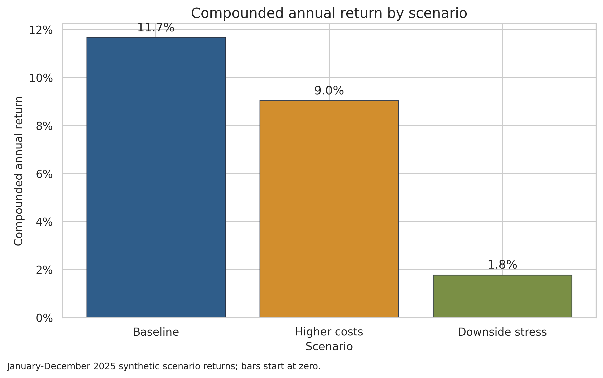

# Pilot Before Scaling: Scenario Review

## Executive Summary

- **Baseline upside is positive but not decision-ready.** The 12-month synthetic baseline compounds to **11.7%** with **5.0%** annualized volatility; this is a scenario illustration, not a forecast.
- **Costs matter, but downside assumptions matter more.** Higher costs reduce return to **9.0%** (**-2.6 percentage points** versus baseline). The downside-stress case falls to **1.8%** (**-9.9 percentage points**) and volatility rises to **9.6%**.
- **Decision: approve only a limited, monitored pilot.** Do not make a full allocation from this evidence. First validate realized implementation cost, drawdown behavior, and performance on live out-of-sample data.

## Stress changes both the return and risk profile

The monthly scatter shows 30 scenario-month observations after the three-month rolling-volatility warm-up. Stress points move toward higher volatility and more negative monthly outcomes, so the downside case is not just a lower average-return assumption.

**What this means:** set an explicit risk budget and stress trigger before launch. A baseline return hurdle alone would miss the main scenario risk.

## Small recurring costs compound into a visible gap

The cumulative paths use the same baseline sequence. The higher-cost case subtracts 0.20 percentage points each month, while the downside case adds two discrete shocks. Ending wealth is **$1.117** per dollar at baseline, **$1.090** with higher costs, and **$1.018** under stress.

**What this means:** pilot monitoring should separate recurring implementation drag from event-driven losses because the remedies differ.

## Annual outcome is most sensitive to downside stress

The exact scenario comparison is:

| Scenario | Annual return | Annual volatility | Return delta vs baseline |
|---|---:|---:|---:|
| Baseline | 11.7% | 5.0% | - |
| Higher costs | 9.0% | 5.0% | -2.6 pp |
| Downside stress | 1.8% | 9.6% | -9.9 pp |

**What this means:** the baseline conclusion is fragile to two adverse months. A full allocation is not justified until the downside scenario is tested against real historical or live observations.

## Recommended Next Steps - What This Means for You

1. Run a limited pilot with pre-set maximum drawdown, cost, and volatility limits.
2. Replace the synthetic monthly series with live or historical out-of-sample returns before any scale-up decision.
3. Recompute scenario metrics after realized costs and at least one stressed period are observed.
4. Escalate for review if rolling volatility approaches the stress scenario or if return falls below the higher-cost case.

## Further Questions

- Are the two stress shocks realistic for the intended asset, holding period, and liquidity?
- What turnover, slippage, tax, and capacity assumptions produce the 0.20% monthly cost case?
- Which benchmark and drawdown threshold define a successful pilot?

## Assumptions and Risks

- All 36 rows are synthetic and cover only January-December 2025 at monthly grain. They demonstrate communication and sensitivity design; they do not estimate an investable opportunity.
- Annual return is the compounded product of 12 monthly returns. Volatility is monthly sample standard deviation multiplied by the square root of 12.
- The return-to-volatility ratio assumes a zero risk-free rate and independent, identically distributed monthly returns; those assumptions are not established.
- The scenarios are designed inputs, not probabilities. No claim is made that one scenario is more likely than another.
- Past or simulated results do not establish causality, persistence, or future performance.
